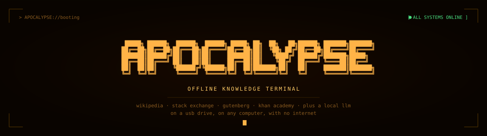
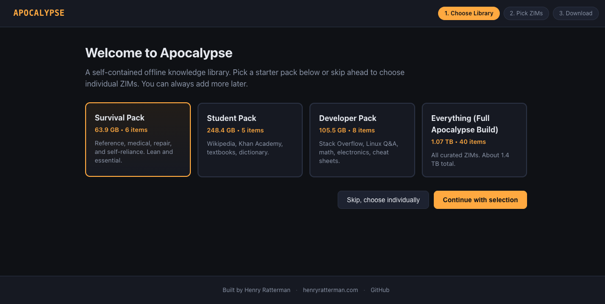
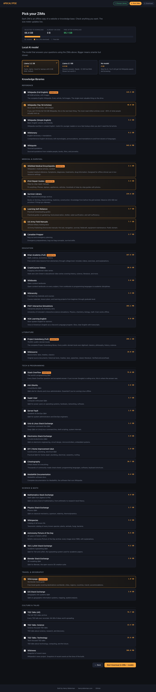
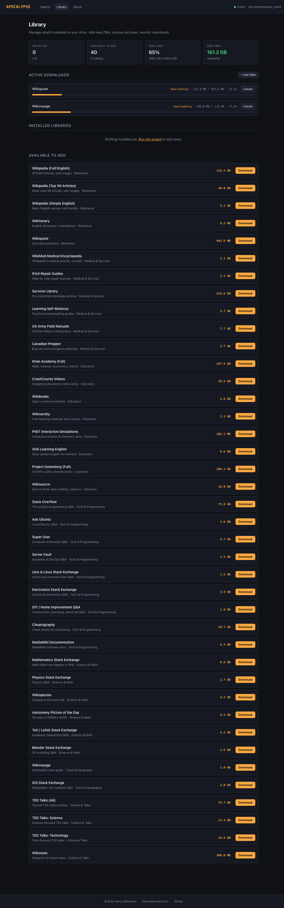
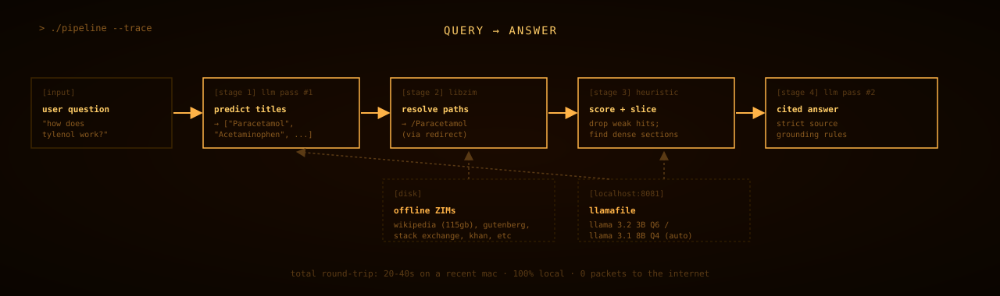
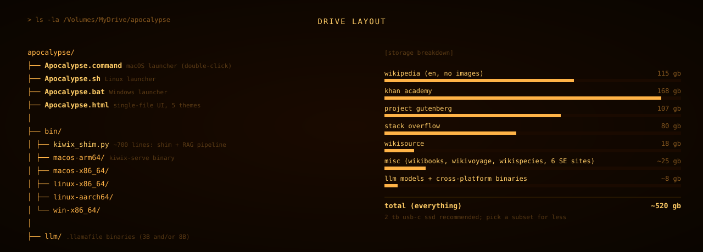
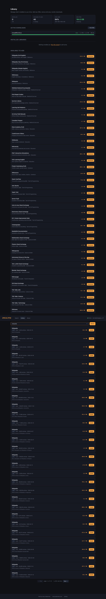

<!--
  README for Apocalypse Drive.
  No em dashes. Anywhere. Ever.
  Hard rule, scan before commit.
-->

<p align="center">
  
</p>

<p align="center">
  <a href="https://github.com/hratterman/apocalypse-drive/stargazers"></a>
  
  
  
  
</p>

<p align="center">
  <b>A self-contained offline knowledge library on a USB drive.</b><br/>
  <i>Wikipedia, Khan Academy, Stack Overflow, Project Gutenberg, and a working AI to talk to them.</i>
</p>

<p align="center">
  <i>Built by <a href="https://henryratterman.com">Henry Ratterman</a>, a marketing major at Indiana University who got tired of assuming the internet would always be there. Also building <a href="https://arduous.io">Arduous</a>.</i>
</p>

<p align="center">
  <a href="#install-the-easy-way">Install</a> ·
  <a href="#make-a-fully-portable-drive">Portable drive</a> ·
  <a href="#whats-on-the-drive">What's on the drive</a> ·
  <a href="#how-it-works">How it works</a> ·
  <a href="#themes">Themes</a> ·
  <a href="#headless-install">Headless install</a>
</p>

---

## Install (the easy way)

Download for your OS, double-click, walk through the setup wizard. The wizard runs in your browser at `localhost:8888` and stays out of your way after.

| OS | Download | Size |
|---|---|---|
| **All-in-one (portable)** | [apocalypse-drive.zip](https://github.com/hratterman/apocalypse-drive/releases/latest) | ~150 MB |
| **macOS** (Apple Silicon + Intel) | [Apocalypse-macOS.dmg](https://github.com/hratterman/apocalypse-drive/releases/latest) | ~50 MB |
| **Windows 10/11** | [Apocalypse-Windows-Setup.exe](https://github.com/hratterman/apocalypse-drive/releases/latest) | ~50 MB |
| **Linux x86_64** | [Apocalypse-Linux-x86_64.tar.gz](https://github.com/hratterman/apocalypse-drive/releases/latest) | ~50 MB |

The installer is small. ZIM files (Wikipedia and friends) are downloaded on demand by the setup wizard, so you only get what you ask for.

> **First launch on macOS** hits Gatekeeper because the app isn't code-signed. Right-click `Apocalypse.app`, choose Open, confirm. Once.<br/>
> **First launch on Windows** may flash SmartScreen. Click "More info" then "Run anyway". Once.

### Use it as a portable drive (any OS, no internet)

The `apocalypse-drive.zip` bundle ships with launchers for all three OSes. Format a USB stick or SD card as exFAT, unzip the bundle to the drive root, double-click the launcher for whichever OS you're on, and pick the drive (not your home folder) in the wizard's Step 1 picker. Done. The same drive then works on a Mac at home, a friend's PC, a Linux laptop on a plane.

For the full walkthrough including hardware recommendations, format commands per OS, and troubleshooting, see [**Make a fully portable drive**](#make-a-fully-portable-drive) below.

If you don't want our app at all, you can still read every ZIM with any [Kiwix reader](https://kiwix.org). The data on the drive is open format.

---

## Make a fully portable drive

A fully portable drive is one you can pull out of any computer, plug into a different OS, and keep working with zero changes to either machine. The drive carries the launchers, the data, the LLM, and the config. Nothing leaks back to the host.

This is different from the **regular install** above, where the .app sits in `/Applications` (or `Program Files`) and your data lives in your home folder. Both work, but only the portable layout survives unplugging.

### What you'll need

| Use case | Storage | Card / drive type |
|---|---|---|
| Survival pack only (~64 GB ZIMs + 3 GB LLM) | **128 GB** minimum | UHS-I V30+ SD card or any USB 3 stick |
| Student / Developer pack (~250 GB) | **256 GB** | USB 3 SSD recommended, V60 SD acceptable |
| Everything pack (~1 TB) | **1 TB+** | USB 3 SSD strongly recommended |

ZIMs are read by random access. SSDs and SD cards both work, but a slow USB 2 stick will make Wikipedia feel like 2008 dial-up. USB 3 + UHS-I V30 or better is the sweet spot for cost vs. speed.

### Format the drive

Format as **exFAT**. This is the only filesystem all three OSes can read AND write to without third-party drivers.

- **macOS**: Disk Utility → select drive → Erase → Format: ExFAT, Scheme: Master Boot Record. Name it something simple like `APOCALYPSE`.
- **Windows**: File Explorer → right-click drive → Format → File system: exFAT, Allocation unit size: 128 KB (faster on big files), Quick Format on. Click Start.
- **Linux**: `sudo mkfs.exfat -n APOCALYPSE /dev/sdX1` (replace `/dev/sdX1` with the real device, **double-check** with `lsblk` first).

> SD card with a tiny lock switch on the side? Make sure it's **unlocked**. The slider physically forces the card read-only and macOS will mount it as read-only with no warning. The wizard now detects this and tells you, but it's worth checking up front.

### Lay the drive out

1. Download `apocalypse-drive.zip` from the [latest release](https://github.com/hratterman/apocalypse-drive/releases/latest).
2. Unzip it to the **drive root**. After unzipping, your drive looks like:

```
APOCALYPSE/
├── Apocalypse.html          ← static fallback (open in any browser, no app needed)
├── README.txt               ← short version of these instructions
├── macos/
│   └── Apocalypse.dmg       ← double-click to mount, drag .app to drive root
├── windows/
│   └── Apocalypse-Setup.exe ← run, install to a folder on the drive
├── linux/
│   └── Apocalypse.tar.gz    ← extract to drive root, run ./Apocalypse/Apocalypse
└── apocalypse/              ← runtime data (filled by the wizard on first run)
    ├── kiwix/zim/           ← your downloaded ZIMs land here
    ├── llm/                 ← optional local LLM
    └── logs/                ← diagnostics
```

The contract is: **everything you need is somewhere on the drive, nothing extra goes to the host.**

### First launch (one OS, doesn't matter which)

Plug the drive into one computer. Pick any OS. The drive will work on all three regardless of which one you set it up from first.

**macOS:**
1. Open the `macos/` folder on the drive.
2. Double-click `Apocalypse.dmg`. A new Finder window mounts.
3. Drag `Apocalypse.app` from the DMG to the **drive root** (alongside `README.txt`). Do NOT drag it to `/Applications`.
4. Eject the DMG.
5. Double-click the .app you just dragged. First run hits Gatekeeper: right-click → Open → confirm.

**Windows:**
1. Open the `windows/` folder.
2. Run `Apocalypse-Setup.exe`. SmartScreen will warn (unsigned binary), choose "More info" → "Run anyway".
3. **When the installer asks where to install, point it at the drive root**, e.g. `D:\Apocalypse`. NOT `Program Files`. This is the step that determines whether your install is portable or not.

**Linux:**
1. Open the `linux/` folder.
2. Extract the archive to the drive root: `cd /media/<you>/APOCALYPSE && tar xzf linux/Apocalypse.tar.gz`.
3. Run it: `./Apocalypse/Apocalypse`.

In all three cases, the wizard opens at `localhost:8888`.

### Wizard: pick the DRIVE, not your home folder

This is the step that makes the difference between "portable" and "stuck on this computer."

In the **Step 1 drive picker**, you'll see your home folder, the boot disk, and any external drives. Click the row that points to the **USB drive's `apocalypse/` folder**. It'll have a green "cross-OS portable" badge if the filesystem is exFAT.

After that the wizard works the same as a regular install: pick a starter pack or à-la-carte ZIMs, pick a local LLM (or skip it), click Start Download, walk away. Everything lands on the drive.

> If you forget and pick "Home folder", your install is no longer portable. To recover: quit the app, copy `~/Apocalypse` to `<drive>/apocalypse`, delete `~/Apocalypse`, relaunch the app FROM the drive.

### Verify it's actually portable

After the first machine finishes downloading, do this sanity check:

1. Quit the app from the menu bar / system tray.
2. Eject the drive properly.
3. Plug the same drive into a different computer (different OS is fine).
4. Run the launcher for THAT OS from the drive.
5. Open `localhost:8888`. Your library should be there with every ZIM you downloaded, every theme preference, every LLM choice. No re-downloading, no re-setup.

If something didn't transfer, the most likely cause is a stale `state.json` on the host. See [Troubleshooting](#troubleshooting) below.

### Troubleshooting

**SD card mounts read-only on macOS** → check the physical lock switch on the card or its adapter. If unlocked and still read-only, run Disk Utility → First Aid. If First Aid fails, back up your data and reformat as exFAT. The wizard's Step 1 will surface a red "read-only mount" tag and a one-click help block when this happens.

**Drive shows up but says "may be read-only"** → soft warning. Click it anyway. The probe is conservative and many fresh exFAT sticks pass on the first real write.

**Windows installer wants `C:\`** → in the installer's "Choose Install Location" step, click Browse and pick a folder on the USB drive instead, e.g. `D:\Apocalypse`. The installer is just a wrapper around the .exe; the choice of install location is what makes the difference.

**Antivirus flags the .exe as suspicious** → it's unsigned (we don't pay Microsoft for a code-signing cert). Add an exception or download the source and build it yourself with `pyinstaller apocalypse.spec`.

**App opens but no menu bar icon** → starting in v1.3.4 the menu bar slot has a glyph fallback (`●` ready, `⚪︎` starting, `↓` downloading, `✕` down) that survives even if Cocoa rejects the icon image. If you don't see EITHER an icon OR a glyph, check `~/.apocalypse_launch.log` and `~/.apocalypse_shim_launch.log` and open an issue with the contents.

**A download errors out at 94%** → from v1.3.6 the wizard's downloads page has per-row Retry / Cancel / Remove buttons. Retry resumes from the existing partial via HTTP Range, so a Wikipedia stuck at 94% picks up at 94%, not zero.

---

### What you'll see

After install, an amber `A` icon shows up in your menu bar (macOS) or system tray (Windows/Linux). Click it to open the app. On first run it auto-opens the setup wizard:

<p align="center">
  
  
</p>

Pick a starter pack, or check individual ZIMs. The disk meter updates live so you know what'll fit. Click Start Download, walk away. Come back to a working library.

### Manage what's on the drive

The Library page lets you add or remove ZIMs anytime. No reinstalls, no terminal.

<p align="center">
  
</p>

---

## What's on the drive

Every ZIM is curated from [library.kiwix.org](https://library.kiwix.org). All of these can be added or removed from the Library page anytime.

| Pack | Size | What's in it |
|---|---|---|
| **Survival Pack** | ~64 GB | Wikipedia (top 1M), WikiMed, iFixit, Army Field Manuals, Self-Reliance, Wikivoyage |
| **Student Pack** | ~248 GB | Wikipedia (top 1M), Khan Academy, Wikibooks, Wiktionary, CrashCourse |
| **Developer Pack** | ~105 GB | Stack Overflow, Ask Ubuntu, Super User, Server Fault, Unix SE, Electronics SE, Cheatography, Math SE |
| **Everything** | ~1.07 TB | All 40 curated ZIMs across 7 categories |

Or pick à la carte from any of these:

<table>
<tr><td><b>Reference</b></td><td>Wikipedia (full or top 1M), Wiktionary, Wikiquote</td></tr>
<tr><td><b>Medical & Survival</b></td><td>WikiMed, iFixit, Survivor Library, Self-Reliance, Army Field Manuals, Canadian Prepper</td></tr>
<tr><td><b>Education</b></td><td>Khan Academy, CrashCourse, Wikibooks, Wikiversity, PhET Simulations, VOA Learning English</td></tr>
<tr><td><b>Literature</b></td><td>Project Gutenberg (70,000+ books), Wikisource</td></tr>
<tr><td><b>Tech & Programming</b></td><td>Stack Overflow, Ask Ubuntu, Super User, Server Fault, Unix SE, Electronics SE, DIY SE, Cheatography, MediaWiki docs</td></tr>
<tr><td><b>Science & Math</b></td><td>Math SE, Physics SE, Wikispecies, NASA APOD, TeX/LaTeX SE, Blender SE</td></tr>
<tr><td><b>Travel & Geography</b></td><td>Wikivoyage, GIS SE</td></tr>
<tr><td><b>Culture & Talks</b></td><td>TED Talks (full or topic-filtered), Wikinews</td></tr>
</table>

Plus a local LLM (Llama 3.2 3B or Llama 3.1 8B via [Mozilla llamafile](https://github.com/Mozilla-Ocho/llamafile)) that answers questions using the ZIMs as a knowledge base.

---

## How it works

<p align="center">
  
</p>

When you ask a question, four things happen in sequence:

1. **Predict titles.** The local LLM sees your question with a few-shot prompt and emits 1 to 3 Wikipedia article titles it thinks are relevant.
2. **Resolve.** A custom Python shim opens the predicted titles directly in the ZIM, walking redirects and disambiguation. Title-prediction beats keyword search by a wide margin on question-shaped queries (e.g. "how do I build a bridge?" lands on `Bridge`, not `Build` (the software-build article)).
3. **Score and extract.** Each candidate gets ranked by lede content overlap. The best one has its densest paragraph extracted, not just the lede.
4. **Generate.** The same LLM gets the question plus the extracted context and writes a real multi-paragraph answer with citations back to the source ZIMs.

End to end, ~22 to 40 seconds on a 3B model, faster on hardware that can run 8B.

### Drive layout

<p align="center">
  
</p>

---

## Themes

Five themes ship with the app. Switch from the Apocalypse main page anytime.

<p align="center">
  
  
</p>

<p align="center">
  
  
</p>

<p align="center">
  <i>And one for the lols:</i><br/>
  
</p>

The "calm" themes (Paper, Forest, Solarized) have zero animation. Terminal has the CRT effects. Geocities is the joke.

---

## Headless install

If you're on a server, a Linux box without a desktop, or you just prefer terminal, there's a headless install path. It does the same thing as the GUI, just without the GUI.

```bash
git clone https://github.com/hratterman/apocalypse-drive.git
cd apocalypse-drive
./install.sh /Volumes/MyDrive/apocalypse
```

Then walk through the prompts. ZIM downloads start at the end. Walk away for a few hours, come back to a working library at `localhost:8888`.

---

## Why a custom shim?

The official `kiwix-serve` binary doesn't work with Wikipedia ZIMs on macOS+exFAT (you get `MMapException` because exFAT doesn't support `mmap` of files larger than 4 GB). Wikipedia is 124 GB. So the app uses its own Python shim built on `libzim` that does direct random reads instead of mmap. The shim also adds the RAG pipeline, the setup wizard, and the admin page. Everything lives in `bin/kiwix_shim.py` and `bin/setup_routes.py`.

---

## Live catalog and full Kiwix browse

The app pulls live metadata from Kiwix every time it runs, so URLs and sizes for the curated 40 ZIMs always point at the freshest available version. If Kiwix is unreachable (no internet, server down) the app silently falls back to the bundled catalog and keeps working.

The Library page also has a **Browse All Kiwix** section that searches the entire live Kiwix library (currently ~3,500 entries across every language and topic Kiwix publishes). Anything they offer, you can install with one click. Curated bundles are a good starting point. Browse is for when you want everything else.



---

## Customization

| Want to | Edit |
|---|---|
| Add or remove ZIMs from the catalog | `data/catalog.json` |
| Change the bundle presets | `data/catalog.json` (the `bundles` block) |
| Tweak the RAG prompt | `bin/kiwix_shim.py` (search for `predict_titles` or `_answer`) |
| Restyle the wizard | `bin/templates/setup.html` |
| Restyle the search UI | `Apocalypse.html` |
| Add a new theme | `Apocalypse.html` (CSS variables + theme name in `THEMES` array) |

---

## Minimum hardware

The web UI, Kiwix search, and games run on almost anything. The LLM is what determines your floor.

| Mode | Power draw | Hardware | Notes |
|---|---|---|---|
| Search + browse only | ~5W | Raspberry Pi 5, any cheap mini PC | No LLM. Wikipedia search, article browsing, maps, games. A 100Wh battery bank runs this 12+ hours. |
| Small LLM (1-3B) | 8-15W | Raspberry Pi 5, Intel N100 mini PC | Llama 3.2 1B or 3B at ~1-3 tokens/sec. Slow but functional for real questions. |
| Decent LLM (7-8B) | 25-60W | Intel N100 or better | Fast enough to be comfortable. Practical floor for an AI-enabled survival drive. |
| Fast LLM (8B+, GPU) | 80-150W+ | MacBook, desktop GPU | Not realistic in a low-power scenario. |

For real sparse-power situations: a Pi 5 with a 7-8B GGUF model at Q4 quantization is around 8-15W under load and still gives you useful AI answers. Below that, drop to search-only mode, which is still genuinely useful, and costs nothing extra in power.

---

## Limitations

- Search inside ZIMs (full-text search) works on most ZIMs but not all. Title-based and LLM-based lookups always work.
- The 3B model is fast but mediocre on dense academic questions. Pick the 8B model if you have 16+ GB RAM.
- Stack Overflow ZIM is read-only and doesn't include comments, only the question and accepted answer.
- ZIMs are dated. The Wikipedia in your drive is whatever was current the day you downloaded it. Re-download to refresh.
- iOS isn't supported. Apple won't allow this kind of app in the App Store and side-loading is too painful for v1.

---

## Built on top of

- [Kiwix](https://kiwix.org) and [openZIM](https://openzim.org) for the ZIM format and the actual content
- [Mozilla llamafile](https://github.com/Mozilla-Ocho/llamafile) for the local LLM runtime
- [Meta Llama 3](https://llama.meta.com) for the model itself
- [libzim](https://github.com/openzim/python-libzim) for Python bindings
- [pystray](https://github.com/moses-palmer/pystray) for the cross-platform tray
- [PyInstaller](https://pyinstaller.org) for the self-contained app bundles
- Every Wikipedia editor, Khan Academy lecturer, and Stack Overflow answer-writer who made the actual content

---

## License

[MIT](LICENSE).

The bundled ZIMs and the LLM each have their own licenses (mostly CC-BY-SA for ZIMs and Llama 3 Community License for the model). Don't sell this. Do whatever else you want.

---

<p align="center">
  Built by <a href="https://henryratterman.com">Henry Ratterman</a> in Bloomington, Indiana<br/>
  <sub>Marketing major. Builds things anyway. Also runs <a href="https://arduous.io">Arduous</a>, an AI fluency assessment for hiring.</sub>
</p>
