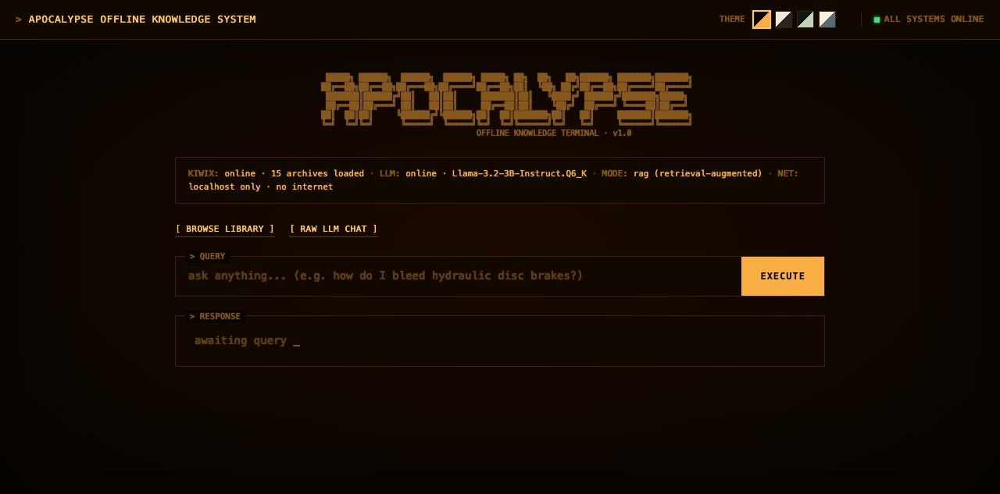
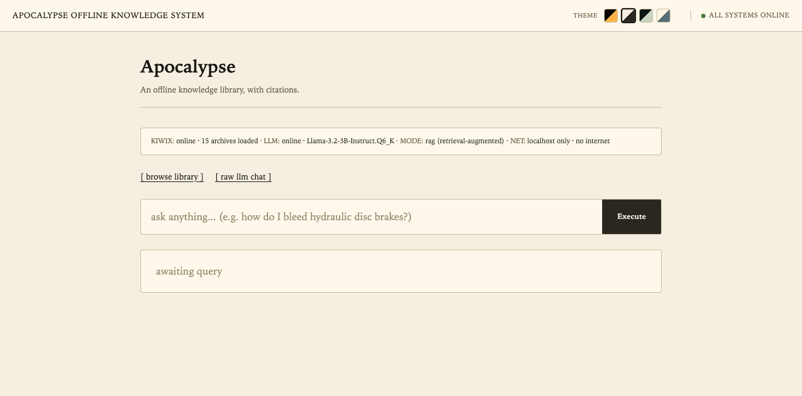
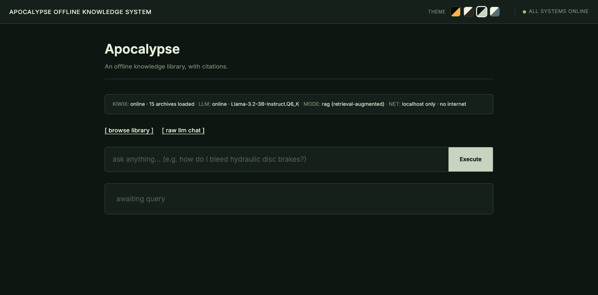
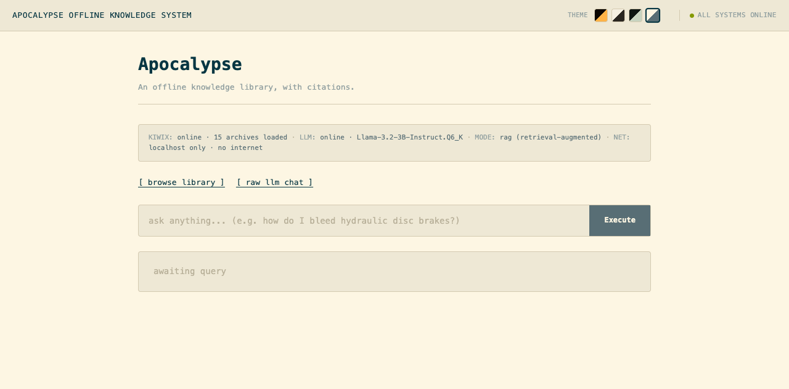
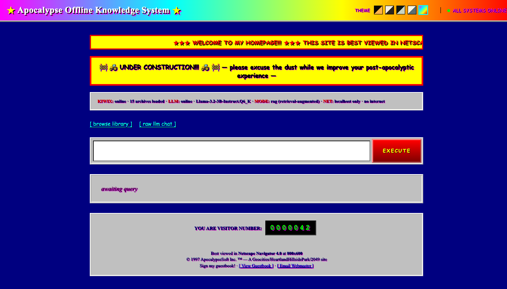

<!--
  README for Apocalypse Drive.
  No em dashes. Anywhere. Ever.
  Hard rule, scan before commit.
-->

<p align="center">
  
</p>

<p align="center">
  <a href="https://github.com/hratterman/apocalypse-drive/stargazers"></a>
  
  
  
  
</p>

<p align="center">
  <b>A self-contained offline knowledge library on a USB drive.</b><br/>
  Wikipedia, Stack Exchange, Project Gutenberg, Khan Academy, plus a local LLM that reads them<br/>
  and answers your questions with citations. Plug in, double-click, no internet needed.
</p>

<p align="center">
  <a href="#quick-start"></a>
  <a href="#how-the-rag-works"></a>
  <a href="#themes"></a>
</p>

---

## What it is

A 2 TB external drive that, when plugged into any Mac, Linux, or Windows machine, gives you:

| | |
|---|---|
| 📖 | **Local Wikipedia** (115 GB, full text, no images), every English article |
| 💬 | **Stack Exchange** (~95 GB), Stack Overflow plus six other sites |
| 📚 | **Project Gutenberg** (107 GB), 70,000+ public domain books |
| 🎓 | **Khan Academy** (168 GB), full course content |
| 🌍 | **Wikivoyage / Wikibooks / Wikisource / Wikispecies** (~28 GB) |
| 🤖 | **A local LLM** (Llama 3.2 3B or 3.1 8B) that runs offline and reads from the above |

You ask a question. The system asks the LLM what Wikipedia article(s) might answer it, fetches those articles from the offline ZIMs, scores relevance, extracts focused sections, and generates a sourced answer with citations. Total round trip on a recent Mac: **20 to 40 seconds.** No packets to the internet. Ever.

> Built for: power outages, travel, hostile networks, places where you don't trust the cloud, and the vague unease that the world's reference shelf shouldn't live on someone else's server.

---

## Quick start

You need an empty external drive (~600 GB recommended for the full library, ~100 GB if you skip Khan Academy and Gutenberg) formatted as exFAT for cross-platform use, or your native filesystem if you only target one OS.

```bash
git clone https://github.com/hratterman/apocalypse-drive.git
cd apocalypse-drive
./install.sh /Volumes/MyDrive/apocalypse
```

The installer will:

1. Create the directory layout
2. Download `kiwix-serve` binaries for 5 platforms (~230 MB)
3. Download the LLM (~2.7 GB for the 3B, ~7.6 GB for both 3B and 8B)
4. Set up cross-platform launchers
5. Optionally kick off the ZIM downloads (this takes hours, go to bed, it'll be done)

When it's done, plug the drive into any computer and run the launcher for your OS:

| OS      | Double-click to launch   |
| :------ | :----------------------- |
| macOS   | `Apocalypse.command`     |
| Linux   | `Apocalypse.sh`          |
| Windows | `Apocalypse.bat`         |

The launcher boots two local services and opens the UI in your browser.

---

## Themes

Five themes, switchable from the top right of the UI. Choice persists in localStorage.

<table>
  <tr>
    <td width="50%" align="center">
      
      <br/><b>Terminal</b><br/>
      <sub>amber phosphor on black, CRT scanlines, flicker, blinking cursor. The default.</sub>
    </td>
    <td width="50%" align="center">
      
      <br/><b>Paper</b><br/>
      <sub>warm cream and serif text, calm and library-like, no animation.</sub>
    </td>
  </tr>
  <tr>
    <td width="50%" align="center">
      
      <br/><b>Forest</b><br/>
      <sub>quiet greens, sans-serif, grounded and easy on the eyes.</sub>
    </td>
    <td width="50%" align="center">
      
      <br/><b>Solarized</b><br/>
      <sub>the classic gentle palette, monospace.</sub>
    </td>
  </tr>
  <tr>
    <td colspan="2" align="center">
      
      <br/><b>Geocities 1997</b><br/>
      <sub>Comic Sans, scrolling marquee, under-construction banner, visitor counter, Win95 ridge bevels. Same RAG pipeline, full nostalgic chaos.</sub>
    </td>
  </tr>
</table>

---

## How the RAG works

<p align="center">
  
</p>

The naïve version: keyword search, top results, feed to LLM. That returns garbage when you ask *"how does Tylenol work?"* because the search engine ranks the Chicago Tylenol murders article above Paracetamol.

This system uses a four stage pipeline:

1. **LLM predicts titles.** Few-shot prompted, the 3B model is great at this. *"how do I build a bridge?"* gets you `["Bridge", "Civil engineering", "Structural engineering"]`. *"why is the sky blue?"* gets you `["Rayleigh scattering", "Diffuse sky radiation", "Sky"]`.

2. **Resolve titles to ZIM paths**, in priority order (Wikipedia, then Wikipedia Medical, then Wikivoyage, then Wikibooks). Tries multiple capitalizations and follows redirects. `Acetaminophen` resolves to `Paracetamol`. `World_War_2` resolves to `World_War_II`.

3. **Score and slice.** A backup keyword search runs only if the LLM gave fewer than 3 hits. Relevance scoring drops obvious garbage (the "Build" article wouldn't survive a question about bridges, since its lede contains zero bridge-related words). Section extraction finds the densest cluster of question-words within each article, beating a dumb "first 6 KB" dump.

4. **Final LLM pass** generates the answer using ONLY the focused sections, with strict citation rules.

The whole pipeline lives in `bin/kiwix_shim.py` as a single ~700-line Python HTTP server using libzim and llamafile's OpenAI-compatible API. The HTML is one self-contained file with all five themes baked in.

---

## What's on the drive

<p align="center">
  
</p>

Everything lives in one directory. No installers run, no system files modified, no daemons left behind. Pull the drive out and the host computer goes back to exactly how it was.

---

## Why a custom shim?

`kiwix-serve`, the standard binary, throws `MMapException` when reading ZIMs from exFAT-formatted drives on macOS. exFAT doesn't support `mmap()` properly and there's no fix coming. The Python `libzim` binding doesn't use `mmap`, so this project ships a minimal HTTP server that serves the same endpoints (`/search`, `/content/<book>/<path>`) using `libzim` directly, plus a new `/answer` endpoint that does the full RAG pipeline.

On Linux and Windows the launcher uses `kiwix-serve` because it's faster. On macOS it uses the Python shim. The user never notices.

---

## Customization

| Want to | Edit |
| :--- | :--- |
| Skip some ZIMs | `kiwix/download.sh`, comment out the lines you don't want |
| Use a different model | Drop any `.llamafile` into `llm/`, the launcher picks it up |
| Change the default theme | Top right of the UI (persists per browser) |
| Adjust the RAG prompt | `TITLE_PREDICTION_SYSTEM` constant in `bin/kiwix_shim.py` |
| Add another knowledge base | Find its ZIM at [library.kiwix.org](https://library.kiwix.org), add to `download.sh` |

---

## Limitations

- ZIMs are **not** updated automatically. Re-run `download.sh` periodically to refresh.
- The 3B model is fast but occasionally hallucinates citations. The 8B is more reliable but needs 16+ GB RAM.
- Search latency depends on drive speed. USB-C SSDs (~500 MB/s read) feel snappy. Spinning USB-A drives (~80 MB/s) feel sluggish for the first query, then warm up.
- Only English ZIMs are wired into the default download script. Add other languages by editing `kiwix/download.sh`.

---

## Built on top of

<table>
  <tr>
    <td align="center" width="25%">
      <a href="https://kiwix.org"><b>Kiwix</b></a><br/>
      <sub>offline content ecosystem, ZIM file format</sub>
    </td>
    <td align="center" width="25%">
      <a href="https://github.com/Mozilla-Ocho/llamafile"><b>llamafile</b></a><br/>
      <sub>single-file LLM distribution</sub>
    </td>
    <td align="center" width="25%">
      <a href="https://llama.meta.com"><b>Llama 3.x</b></a><br/>
      <sub>Meta's open-weights models</sub>
    </td>
    <td align="center" width="25%">
      <a href="https://github.com/openzim/libzim"><b>libzim</b></a><br/>
      <sub>Python bindings for ZIM access</sub>
    </td>
  </tr>
</table>

---

<p align="center">
  <sub>MIT licensed. Ship it, fork it, use it however.</sub><br/>
  <sub>Built by <a href="https://github.com/hratterman">Henry Ratterman</a> in Bloomington, Indiana.</sub>
</p>
